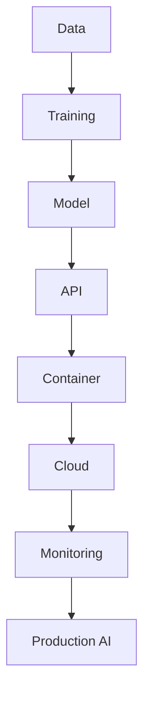

# <div align="center">⚔️ SAHIL SHARMA ⚔️</div>

<div align="center">


</div>

---

<div align="center">


</div>

# 🌌 CHARACTER PROFILE

```yaml
Name: Sahil Sharma
Class: Aspiring MLOps Engineer
Specialization: AI Infrastructure
Affiliation: Cloud Native AI Systems
Current Arc: Production AI Engineering
Mission: Deploy scalable intelligent systems
Status: Training...
```

---

# ⚡ POWER SYSTEM

<div align="center">

| Skill Tree                 | Progress   |
| -------------------------- | ---------- |
| 🐍 Python Core             | ███████░░░ |
| ☁️ AWS Cloud               | ██████░░░░ |
| ⚙️ MLOps                   | ████░░░░░░ |
| 🤖 AI Systems              | █████░░░░░ |
| 🛰️ Deployment Engineering | ███░░░░░░░ |
| 🧠 LLMOps                  | ██░░░░░░░░ |

</div>

---

# 🧬 CORE ABILITIES

<div align="center">


</div>

---

# 🔮 LEARNING PATHWAY

<div align="center">


</div>

---

# ⚔️ TRAINING ARC

```bash
[ DAY 1 ] Python Foundations
        ↓
[ DAY 20 ] ML Workflows
        ↓
[ DAY 45 ] Cloud Deployment
        ↓
[ DAY 70 ] API Engineering
        ↓
[ DAY 100 ] Production AI Systems
```

---

# 🌠 AI DEPLOYMENT PIPELINE

```text
DATA SOURCE
     ↓
MODEL TRAINING
     ↓
FASTAPI SERVICE
     ↓
DOCKER CONTAINER
     ↓
AWS CLOUD
     ↓
MONITORING
     ↓
SCALABLE AI SYSTEM
```

---

# 🛰️ ACTIVE QUESTS

* Building deployment-ready AI projects
* Learning cloud-native ML systems
* Exploring AI infrastructure workflows
* Understanding scalable inference systems
* Developing production-first mindset
* Exploring future AI engineering ecosystems

---

# 📊 SYSTEM ANALYTICS

<div align="center">


</div>

---

# 📈 BATTLE ACTIVITY

<div align="center">


</div>

---

# 🧠 AI SYSTEMS MAP



---

# 🌐 COMMUNICATION PORTAL

<div align="center">

<a href="https://github.com/sahil0078sharma-oss">

</a>

<a href="https://www.linkedin.com/in/sahil-sharma-b8032830b/">

</a>

<a href="mailto:sahil0078sharma@gmail.com">

</a>

</div>

---

<div align="center">

```bash
> awakening_ai_infrastructure...
> mastering_cloud_native_systems...
> evolving_into_production_engineer...
```


</div>
