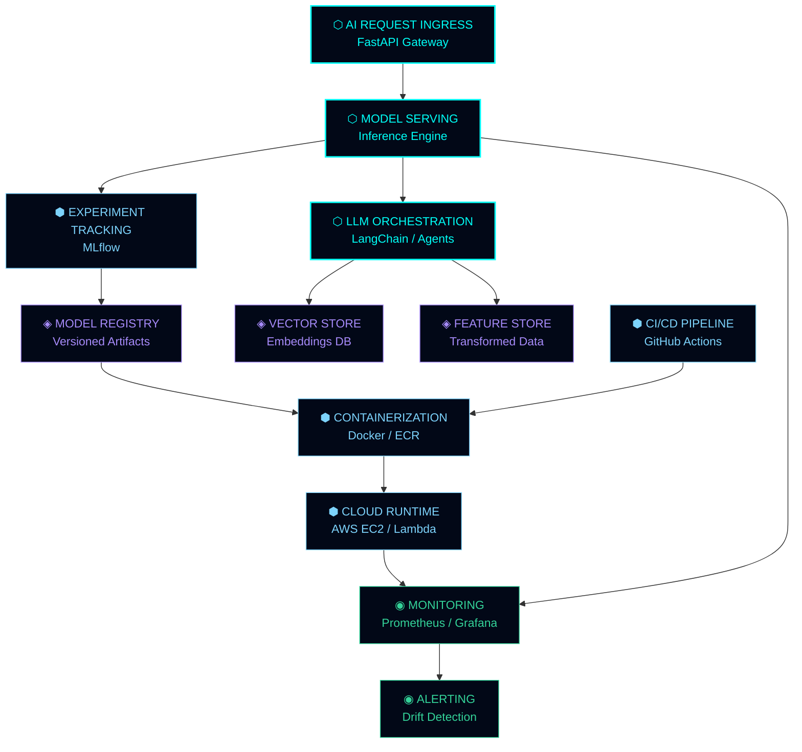
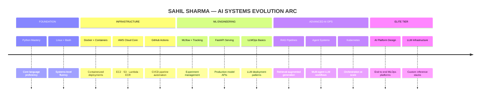

<div align="center">

<!--══════════════════════════════════════════════════════════════════════════════
    SYSTEM BOOT SEQUENCE — SAHIL SHARMA / AI INFRASTRUCTURE NODE
══════════════════════════════════════════════════════════════════════════════-->


</div>

<div align="center">

```
╔══════════════════════════════════════════════════════════════════════════╗
║  NODE_ID: SS-AIINFRA-001     STATUS: ONLINE     BUILD: EVOLUTION-2025   ║
║  DOMAIN:  MLOps + LLMOps + Cloud-Native AI     SIGNAL: ████████░░ 82%  ║
╚══════════════════════════════════════════════════════════════════════════╝
```

[](https://git.io/typing-svg)

</div>

---

<!--══════════ IDENTITY CORE ══════════-->

<table width="100%">
<tr>
<td width="50%" valign="top">

### `» IDENTITY_CORE`

```yaml
operator    : Sahil Sharma
designation : Aspiring AI Systems Engineer
vector      : MLOps + LLMOps + Cloud-Native AI
protocol    : Production-First. Infrastructure-Led.
system_mode : [ LEARNING → BUILDING → DEPLOYING ]
directive   : Engineer intelligence at scale.
```

</td>
<td width="50%" valign="top">

### `» CURRENT_MISSION`

```python
class SahilSharma:
    focus   = "Production AI Infrastructure"
    stack   = ["Python","AWS","Docker","FastAPI"]
    ops     = ["MLOps","LLMOps","CloudNative"]
    status  = "Actively Engineering"
    target  = "Elite AI Systems Role"

    def deploy(self):
        return "Reliable. Scalable. Real."
```

</td>
</tr>
</table>

---

<!--══════════ TECH STACK MATRIX ══════════-->

<div align="center">

## `⬡ TECH STACK MATRIX — ACTIVE SYSTEMS`

<br/>

**`[ COMPUTE LAYER ]`**


**`[ INFRASTRUCTURE LAYER ]`**


**`[ AI / ML LAYER ]`**


**`[ DATA LAYER ]`**


</div>

---

<!--══════════ AI INFRASTRUCTURE MAP ══════════-->

<div align="center">

## `⬡ AI PRODUCTION INFRASTRUCTURE — SYSTEM MAP`

</div>



---

<!--══════════ DEPLOYMENT TERMINAL ══════════-->

<div align="center">

## `⬡ DEPLOYMENT TERMINAL — LIVE SEQUENCE`

</div>

```bash
╭─ sahil@ai-infra-node  ~/production-systems  [main ✓]
│
├─ $ docker build -t sahil/llm-service:v2.3.1 .
│    ✔  Layer cache hit     [0.12s]
│    ✔  Dependencies locked [1.84s]
│    ✔  Model artifacts     [3.21s]
│    ✔  Build complete      → IMAGE READY
│
├─ $ aws ecr get-login-token | docker push sahil/llm-service:v2.3.1
│    ✔  Authentication OK
│    ✔  Pushed 847MB → us-east-1.ecr.amazonaws.com
│
├─ $ python deploy/mlflow_register.py --model llm-service --stage Production
│    ✔  Run ID: a3f8c2e19d77
│    ✔  Metrics logged: latency_p99=142ms | throughput=340rps
│    ✔  Model promoted → [ STAGING → PRODUCTION ]
│
├─ $ fastapi run app/main.py --host 0.0.0.0 --port 8080
│    ✔  Routes mounted: /infer /health /metrics
│    ✔  Workers: 4 | Mode: ASYNC
│    INFO:     Application startup complete.
│
╰─ STATUS: ALL SYSTEMS NOMINAL  ▮▮▮▮▮▮▮▮▮▮  100%
```

---

<!--══════════ CURRENT ENGINEERING VECTORS ══════════-->

<div align="center">

## `⬡ ENGINEERING VECTORS — ACTIVE TRAJECTORIES`

</div>

<table width="100%">
<tr>
<td width="33%" align="center" valign="top">

**`⬡ MLOps Core`**

```
Model Versioning      ████████░░
Experiment Tracking   ███████░░░
Pipeline Automation   ██████░░░░
Drift Monitoring      █████░░░░░
```

</td>
<td width="33%" align="center" valign="top">

**`⬡ Cloud Native AI`**

```
AWS Services          ███████░░░
Container Ops         ████████░░
Serverless Deploy     █████░░░░░
Infrastructure as Code████░░░░░░
```

</td>
<td width="33%" align="center" valign="top">

**`⬡ LLMOps`**

```
LLM API Integration   ████████░░
Prompt Engineering    ███████░░░
RAG Pipelines         ██████░░░░
Agent Workflows       █████░░░░░
```

</td>
</tr>
</table>

---

<!--══════════ SYSTEM MODULES ══════════-->

<div align="center">

## `⬡ ACTIVE SYSTEM MODULES`

</div>

<table width="100%">
<tr>
<td width="50%" valign="top">

```
╔══════════════════════════════════════╗
║  MODULE: LLM SERVING ARCHITECTURE   ║
╠══════════════════════════════════════╣
║                                      ║
║  ▸ FastAPI async inference endpoint  ║
║  ▸ Streaming token response layer    ║
║  ▸ Rate-limiting + auth middleware   ║
║  ▸ Prometheus metrics export         ║
║  ▸ Docker containerized deployment   ║
║                                      ║
║  STATUS: [ ACTIVE ]    v0.4.2-beta   ║
╚══════════════════════════════════════╝
```

</td>
<td width="50%" valign="top">

```
╔══════════════════════════════════════╗
║  MODULE: RAG PIPELINE ENGINE         ║
╠══════════════════════════════════════╣
║                                      ║
║  ▸ Document ingestion + chunking     ║
║  ▸ Embedding generation (HuggingFace)║
║  ▸ Vector similarity search layer    ║
║  ▸ Context-aware LLM generation      ║
║  ▸ Response quality evaluation       ║
║                                      ║
║  STATUS: [ BUILDING ]  v0.2.0-alpha  ║
╚══════════════════════════════════════╝
```

</td>
</tr>
<tr>
<td width="50%" valign="top">

```
╔══════════════════════════════════════╗
║  MODULE: MLOPS EXPERIMENT TRACKER   ║
╠══════════════════════════════════════╣
║                                      ║
║  ▸ MLflow experiment management      ║
║  ▸ Hyperparameter sweep logging      ║
║  ▸ Artifact versioning + registry    ║
║  ▸ Model staging → production gates  ║
║  ▸ Automated eval scoring pipeline   ║
║                                      ║
║  STATUS: [ ACTIVE ]    v1.1.0        ║
╚══════════════════════════════════════╝
```

</td>
<td width="50%" valign="top">

```
╔══════════════════════════════════════╗
║  MODULE: CLOUD DEPLOY PIPELINE       ║
╠══════════════════════════════════════╣
║                                      ║
║  ▸ GitHub Actions CI/CD workflows    ║
║  ▸ Docker → ECR automated push       ║
║  ▸ AWS ECS task definition deploy    ║
║  ▸ Blue/green rollout strategy       ║
║  ▸ Health-check gated promotion      ║
║                                      ║
║  STATUS: [ BUILDING ]  v0.3.1        ║
╚══════════════════════════════════════╝
```

</td>
</tr>
</table>

---

<!--══════════ GITHUB ANALYTICS ══════════-->

<div align="center">

## `⬡ COMMAND CENTER — ANALYTICS`

<br/>


&nbsp;&nbsp;


<br/><br/>


<br/><br/>


</div>

---

<!--══════════ SIGNAL ORIGIN / PHILOSOPHY ══════════-->

<div align="center">

## `⬡ SIGNAL_ORIGIN — ENGINEERING PHILOSOPHY`

</div>

```
┌─────────────────────────────────────────────────────────────────────┐
│                                                                     │
│   "AI is not the product. The infrastructure that runs it is."     │
│                                                                     │
│   The gap between a model that works in a notebook                  │
│   and a model that serves a million users reliably —                │
│   that gap is called MLOps.                                         │
│                                                                     │
│   I'm building the bridge.                                          │
│                                                                     │
└─────────────────────────────────────────────────────────────────────┘
```

---

<!--══════════ LEARNING ROADMAP ══════════-->

<div align="center">

## `⬡ EVOLUTION ROADMAP — TRAJECTORY SEQUENCE`

</div>



---

<!--══════════ CONNECT ══════════-->

<div align="center">

## `⬡ OPEN CHANNEL — ESTABLISH CONNECTION`

<br/>

[](https://linkedin.com)
[](mailto:sahil@example.com)
[](https://github.com)

<br/>

```
If you're building AI infrastructure, production ML systems,
or anything that needs to survive contact with real users —

Let's talk.
```

<br/>


</div>

---

<!--══════════ FOOTER ══════════-->

<div align="center">


```
[ NODE SS-AIINFRA-001 ] — ALL SYSTEMS NOMINAL — UPTIME: CONTINUOUS
```

*Infrastructure today. Intelligence at scale tomorrow.*

</div>
