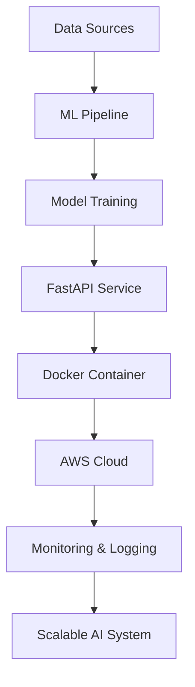

# <div align="center">⚡ SAHIL SHARMA ⚡</div>

<div align="center">


</div>

---

<div align="center">


</div>

---

```bash
> initializing_ai_infrastructure...
> deploying_future_ready_systems...
> learning_cloud_native_ml_workflows...
> status :: evolving
```

# ⚙️ SYSTEM PROFILE

```yaml
Name: Sahil Sharma
Role: Aspiring MLOps Engineer
Domain: AI Infrastructure & Cloud Native ML
Focus: Production AI Systems
Education: B.Tech CSE
Current Mission: Building scalable AI engineering skills
Mindset: Learn → Build → Deploy → Scale
```

---

# 🌌 AI ENGINEERING FOCUS

<div align="center">

| Domain            | Current Direction            |
| ----------------- | ---------------------------- |
| ☁️ Cloud          | AWS Ecosystem                |
| 🤖 AI Systems     | Production-Oriented AI       |
| ⚡ MLOps           | Deployment & Monitoring      |
| 🧠 LLMOps         | Exploring RAG & AI Workflows |
| 🐳 Infrastructure | Docker & Containerization    |
| 🔄 Automation     | CI/CD & Workflow Thinking    |
| 📊 Data           | ML Data Pipelines            |

</div>

---

# 🧠 CURRENT TECH STACK

<div align="center">

## Languages & Foundations


## Cloud & Infrastructure


## Data & AI Ecosystem


</div>

---

# 🚀 LEARNING & EXPLORING

<div align="center">


</div>

---

# 🛰️ PRODUCTION AI ROADMAP

```text
DATA → TRAINING → API → CONTAINERIZATION → CLOUD → MONITORING

CSV / DATABASE
       ↓
MODEL TRAINING
       ↓
FASTAPI SERVICE
       ↓
DOCKER CONTAINER
       ↓
AWS DEPLOYMENT
       ↓
LOGGING & MONITORING
```

---

# ⚡ CURRENT ENGINEERING OBJECTIVES

* Building strong Python foundations for AI engineering
* Understanding AWS cloud services & infrastructure
* Learning deployment-first machine learning workflows
* Exploring scalable AI system architecture
* Understanding CI/CD for ML systems
* Building production-oriented AI projects
* Developing cloud-native engineering mindset

---

# 📡 AI INFRASTRUCTURE STATUS

<div align="center">

| System                 | Status         |
| ---------------------- | -------------- |
| Python Foundations     | ⚡ Initializing |
| AWS Cloud Learning     | 🚀 Active      |
| MLOps Fundamentals     | ⚡ In Progress  |
| LLMOps Exploration     | 🌌 Starting    |
| Production AI Thinking | 🧠 Growing     |
| Deployment Engineering | 🔄 Learning    |

</div>

---

# 🏗️ FEATURED PROJECT ZONE

## 🤖 Production AI Projects

```bash
# upcoming_projects
├── ml-api-deployment
├── ai-monitoring-dashboard
├── cloud-native-ml-pipeline
├── rag-powered-ai-system
└── scalable-inference-api
```

---

# 📊 GITHUB ANALYTICS

<div align="center">


</div>

---

# 📈 CONTRIBUTION ACTIVITY

<div align="center">


</div>

---

# 🧬 AI SYSTEMS ECOSYSTEM

<div align="center">



</div>

---

# 🌐 CONNECT

<div align="center">

<a href="https://github.com/sahil0078sharma-oss">

</a>

<a href="https://www.linkedin.com/in/sahil-sharma-b8032830b/">

</a>

<a href="mailto:sahil0078sharma@gmail.com">

</a>

</div>

---

<div align="center">

```bash
> building_production_grade_ai_systems...
> evolving_every_day...
```


</div>
